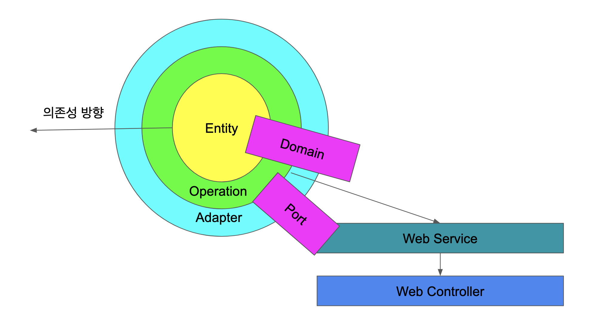

# 개요

예전부터 고민한 내용이 있었다.

애플리케이션은 시간이 지나면 매우 커지는데 이를 방지할 수 있을지.

가끔 속도를 위주로 controller 영역에서 Entity 클래스를 사용하기도 하고, controller 영역의 개념들(HttpServletRequest) 가 service 영역으로 침범하는 경우도 있는데 이걸
어떻게 하면 방지할 수 있을까. 예를 들어 아래 코드가 있다.

```java

@Entity
public class Board {

}

@RestController
public class BoardController {
    @Autowired
    private BoardService boardService;

    @RequestMapping("/board")
    public Board addBoard(@RequestBody Board board) {
        return boardService.add(board);
    }
}
```

커지는 것을 방지하기 위해서는 프로젝트 여러개의 모듈로 나눠야 하는데 어떻게 나누는게 제일 효과적일지

모듈로 나눈다. 각 모듈별로는 dto 로 통신하는게 이상적인데 매번 그렇게 dto 를 생성해야 하는지

모듈을 나눌때, 어떻게 나눠야 하는가. 공통 core 에 주요 로직을 넣으면 되는가?

그렇게 고민하던 도중 clean architecture 책을 보고, 많은 영감을 얻었지만 다시 이걸 어떻게 적용할지에 관한 많은 고민을 다시 하게 되었다.

그러던 도중
책 [만들면서 배우는 클린 아키텍처](http://www.kyobobook.co.kr/product/detailViewKor.laf?mallGb=KOR&ejkGb=KOR&barcode=9791158392758) 를
보게 되었고, 그동안 고민하던 내용을 한번 나름 적용해보고 싶은 욕구가 들어 한번 간단한 프로젝트를 만들게 되었다.

# 프로젝트 설명

이 프로젝트는 제대로 동작하지 않은 단순 프로젝트이다. 제대로 동작하기 보다는 내가 생각하던 프로젝트 구성을 구현하고, 내가 평소에 사용하던 기술인, 스프링, 스프링 MVC, 스프링 JPA, QueryDSL 들을
넣으면서 이를 다시금 정리하는 면도 있다.

또한 이 내용은 위의 클린 아키텍처에서 제공하는 내용과 많이 다르다. 책에 나온 프로젝트 구성을 내 생각에 가장 작업하기 편한 내용대로 구성했다고 보면 된다.

우선 이 프로젝트에서 내가 원한 내용은 다음과 같다.

1. 도메인 중심으로 설계한다.
2. 여러 모듈로 나눈다.

프로젝트의 각 모듈은 아래 그림과 같다.


구성에 대해 하나씩 설명한다.

1. Domain
    * 한 모듈을 관통하는 개념
    * 이 모듈의 모든 하위모듈은 모두 이 도메인을 포함한다.
2. Entity
    * Entity 모듈은 DB 와 통신한다.
    * JPA 의 Entity 는 외부로 노출되지 않도록 한다.
    * 한 모듈에서 과도하게 사용될 수 있는 위험이 있다. 위험을 방지하기 위해 이 서브모듈은 무조건 interface 로 구성, 과도한 사용에서 발생하는 위험을 최소한다.
    * 각 모듈별 통신에 interface 를 사용하는 아이디어는 `만들면서 배우는 클린아키첵처` 에서 가져왔다.
3. Operation
    * clean architecture 에서 application 영역
    * 이름이 특이하다고 생각 할 수 있다. IDE 에서 의존성 별로 정렬을 하고 싶어 이름을 이렇게 지음
    * 여기에는 비즈니스 로직이 들어가, 각 모듈의 주요 비즈니스를 책임지도록 한다.
4. Adapter
    * 이 모듈을 사용하는 다른 모듈과의 통신을 책임지는 클래스
    * 다른 모듈들은 이 모듈을 사용할때는 adapter 를 사용하도록 한다.
    * 실은 이 모듈은 JPA 때문에 고민한 내용이기도 하다. JPA 의 Lazy Loading 을 사용해야 하는 경우, 부득이하게 Web Service 에 JPA 의존성이 생길 수 있는 위험이 있어, 이를
      adapter 에서 처리.
5. Port
    * adpater 를 통해 외부에 노출된다.
    * 이 모듈도 외부 노출의 부작용을 최소화 하기 위해 인터페이스로만 만든다.
    * 모듈 외부로 나가는 데이터 output 과, 모듈 내부로 들어오는 데이터인 input 으로 구성되어있다.

이렇게 구성함으로 아래와 같은 이점이 있다고 생각한다.

1. 불필요한 내용을 외부로 노출하지 않도록 강제
    * 위에서 예시로 든, controller 에서 Entity 를 사용하는 문제의 경우, module 의 entity 는 외부로 노출이 되지 않아, 발생할 수 없다.
2. 어플리케이션의 각 내용을 모듈로 나눠 복잡도를 줄인다.
    * 가끔 어플리케이션을 작성하면, 여러 모듈들이 섞일때 복잡도가 발생하는 경우를 많이 본다. core 모듈, common 모듈에 과도한 로직이 들어가면서 생기는 위험도를 줄인다.
    * 예제 코드에서는 board 와 account 를 분리, 두개의 도메인이 섞이지 않도록 구성을 하였다. board 와 account 의 코드가 섞이지 않도록 관리가 된다.

하지만 아래와 같은 불편함을 느낄 수 있다.

1. 과도한 작업이 든다.
    * 단순 repository, service 두 단계로 끝날 일이 복잡해졌다.
    * 그렇기 때문에 간단한 프로젝트에서 원하지 않는 설계일 수 있다.
2. 불필요한 성능 이슈가 생길 수 있다.
    * module 별로 나누었기 때문에, Board 에서 Acount 디비로 join 을 하지 못한다. 예전에면 하나의 쿼리로 끝날 일이 여러 쿼리로 나뉘게된다.
    * Board 를 작성한 account 정보가 필요하다고 해보자. 예전이면 board 에서 account 조인을 하여 쉽게 알아낼 수 있었지만, 이 구성으로는 board 에서 가져온 내용을 따로 account
      로 조회해야 한다는 번거로움이 있다.

이 구성은 정답이 아니다. 게다가 실제로 프로젝트에서 적용해 본 방법이 아니라 부족한 점이 많을 수 있지만, 하지만, 소프트웨어를 오래 유지보수를 하고 싶은, 그렇기 때문에 작은 모듈별로 나누는 것을 원하는 분들에게
이 구성이 하나의 이정표가 될 수 있으면 좋겠다.
